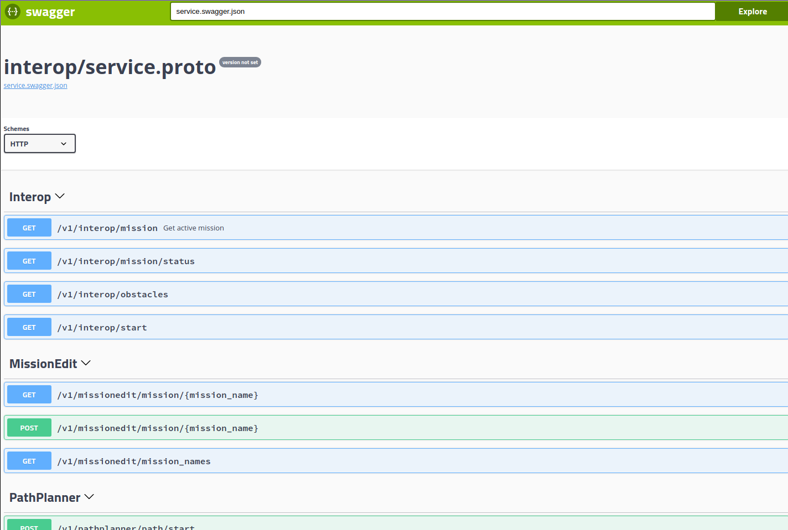

# Hub

[](https://github.com/tritonuas/hub/actions?query=workflow%3ALinting)
[](https://github.com/tritonuas/hub/actions?query=workflow%3ATests)
[](https://github.com/tritonuas/hub/actions?query=workflow%3ADocker)


Hub is a backend webserver that faciliates communication between many
other modules in the TUAS system, including
[Houston](https://github.com/tritonuas/houston),
[OBC](https://github.com/tritonuas/planeobc), Mavproxy, and more. It
also communicates with the [Interop Judging
Server](https://github.com/auvsi-suas/interop) to grab the mission
plans and submit waypoints.
As of now, it does NOT deal with computer vision stuff; for that, see
[matts-new-glasses](https://github.com/tritonuas/matts-new-glasses).

The hub is currently hosted on
[Dockerhub](https://hub.docker.com/repository/docker/tritonuas/hub).

## Dependencies

- go 1.14
- protobuf-compiler

Both of these should be handled with this script

```sh
# install go and protobuf-compiler
make install-dependencies
```

## Usage

### Local

```sh
# build hub
make build
# run hub with testuser
make run
```

### Docker

```sh
# docker build
make docker-build
# run
make docker-run
```

## Swagger UI

To view the Swagger-UI docs without running the server, go into the third_party/swagger-ui folder and run `python3 -m http.server`. Then, go to localhost:8000 on your browser.



## Ports and Stuff

Check [houston](https://github.com/tritonuas/houston) for usage instructions

In houston, the `Backend Addr` always needs to match that of hub

```sh
# find ip of hub
docker inspect -f '{{range .NetworkSettings.Networks}}{{.IPAddress}}{{end}}' container_name_or_id
```

## Test

```
make test
```
