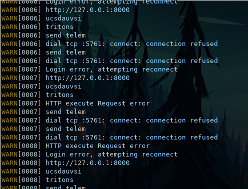
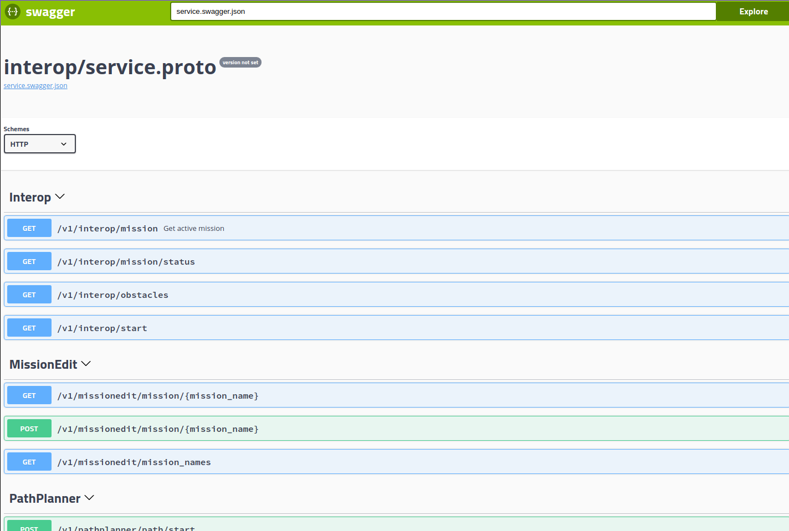

# Hub &middot; [](https://travis-ci.com/tritonuas/hub)
Hub is a backend webserver that faciliates communication between many other modules in the TUAS system, including [Houston](https://github.com/tritonuas/houston), [OBC](https://github.com/tritonuas/planeobc), Mavproxy, and more. It also communicates with the [Interop Judging Server](https://github.com/auvsi-suas/interop) to grab the mission plans and submit waypoints.  
As of now, it does NOT deal with computer vision stuff; for that, see [matts-new-glasses](https://github.com/tritonuas/matts-new-glasses).  

The hub is currently hosted on [Dockerhub](https://hub.docker.com/repository/docker/tritonuas/hub).

## Dependencies

- [go 1.14](https://golang.org/)

## Install

### Local Install

```sh
# Configure global git url to use ssh method:
git config --global url."git@github.com:".insteadOf "https://github.com/"
# Build go application
go build
```

or 

```sh
# Runs above commands
make 
```

hub is running if you see logs printed out, like below.

  


# WARNING everything below this may need fixing

### Docker Build
To create a Docker image of hub and push it to Dockerhub:
1. Run `make docker-build`  
This will invoke the Dockerfile to build a new Docker image of hub
2. Run `make docker-run`
This will run the aforementioned Docker image as a container. Make sure that this works before pushing it.
3. To push it with a tag, run:
```
docker build -t tritonuas/hub:1.x.x -f Dockerfile .
docker push tritonuas/hub:1.x.x
```
Replace 1.x.x with the version you want to create.

### Docker Run
**THIS IS FOR PEOPLE WHO JUST WANT TO RUN HUB WITHOUT CHANGING IT**  
To run the uploaded Docker image without having to compile hub:
```
docker run tritonuas/hub:1.x.x
```
Replace 1.x.x with the version you want to run.  
OR  
```
make docker-run
```

## Swagger UI
To view the Swagger-UI docs without running the server, go into the third_party/swagger-ui folder and run `python3 -m http.server`. Then, go to localhost:8000 on your browser.



## Ports and Stuff
Hub interface to houston currently runs on port `5000` or `5001`
To connect to hub from houston:  
If running from source
1. `netstat -tulpn`
2. Check if port 5000 and/or 5001 is running
3. Go to houston, input `127.0.0.1:5000`

If running from docker
1. `docker container ls`
2. Find the name of hub
3. `docker container inspect [name of hub]`
4. Find network, make sure it is on the same network as houston. If running houston from npm, make sure to expose port
i.e. `docker container run tritonuas/houston -p 5000:5000 -p 5001:5001`
5. If port is exposed, input `127.0.0.1:5000` to houston. Otherwise, put `[hub's ip address]:5000` 

## Test

```
make test
```


